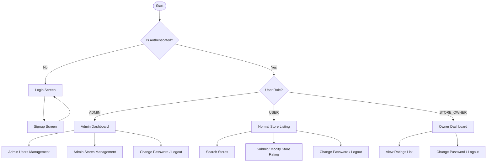

# Application Flow Document (App Flow)

## 1. Application Flow Overview
RateHub utilizes a single authentication system (Login page) which detects the authenticated user's role and redirects them to their respective dashboard experience.

---

## 2. Public vs. Authenticated Routes

### Public Routes:
- `/login`: Single sign-on portal for all user roles.
- `/signup`: Public registration screen for **Normal Users** only.

### Authenticated Routes:
- **Admin Pages**:
  - `/admin/dashboard`: Platform-level statistics.
  - `/admin/users`: User list, search, filter, sort, pagination, and Add User page.
  - `/admin/users/:id`: Details view for a specific user (including their associated store if they are an owner).
  - `/admin/stores`: Store list, search, filter, sort, pagination, and Add Store page.
  - `/admin/stores/new`: Create store page.
- **Normal User Pages**:
  - `/stores`: Central store directory listing with interactive ratings.
- **Store Owner Pages**:
  - `/owner/dashboard`: Business dashboard showing average rating, total ratings count, and owner options.
  - `/owner/ratings`: Detail view of all customers who submitted ratings for the owned store.
- **Shared Pages**:
  - `/change-password`: Safe page accessible to all logged-in roles to change passwords.
  - `/unauthorized`: Error screen shown when an authenticated user attempts to access pages outside their permissions.

*Unauthenticated users attempting to access protected paths are immediately redirected back to `/login` with their return URL cached.*

---

## 3. Detailed Screen Walkthrough & UI Inventory

### 3.1 Login Screen (`/login`)
- **UI Elements**:
  - Email text field (required, format validated).
  - Password password field (required, masked by default, optional show/hide control).
  - "Login" button (disabled on click, shows loading state: `Logging in...`).
  - "Create Account" hyperlink (navigates to `/signup`).
- **Validation**:
  - Empty field check.
  - Email format validation.
- **Errors**:
  - Generic error: "Invalid email or password" (never reveal which field was incorrect).
  - Connection error: "Unable to log in right now. Please try again."

### 3.2 Signup Screen (`/signup`)
- **UI Elements**:
  - Name (20–60 characters).
  - Email (Standard format).
  - Address (Max 400 characters).
  - Password (8–16 characters, 1 uppercase letter, 1 special character).
  - Confirm Password (must match Password).
  - "Create Account" button (disabled on click, shows loading state: `Creating account...`).
  - "Already have an account? Login" link.
- **Validation**:
  - Match passwords.
  - Character bounds checking on Name, Address, Password.
- **Success / Navigation**:
  - Show toast: "Account created successfully. Please log in to continue."
  - Navigate to `/login`.

### 3.3 Admin Dashboard (`/admin/dashboard`)
- **UI Elements**:
  - Metric Card 1: **Total Users** (total active database users count).
  - Metric Card 2: **Total Stores** (total registered stores count).
  - Metric Card 3: **Total Ratings** (total ratings submitted count).
  - Navigation Sidebar (links to Dashboard, Users, Stores, Profile, Logout).
- **Loading State**:
  - Card values show greyed-out skeletons during fetch.
- **Empty State**:
  - Shows "No platform activity yet" with zero values (`0`) instead of breaking.
- **Error State**:
  - Card displays: "Unable to load dashboard statistics. [ Retry ]". Clicking retry refetches dashboard metrics.

### 3.4 Admin Users Page (`/admin/users`)
- **UI Elements**:
  - Filters Panel: Search by Name, Search by Email, Search by Address, filter by Role dropdown (`All`, `Normal User`, `Store Owner`, `Administrator`).
  - "Add User" button (navigates to `/admin/users/new`).
  - Users Table: Columns (Name, Email, Address, Role, Action).
    - Sortable columns: Name, Email, Address, Role.
    - Action column contains a "View" button mapping to `/admin/users/:id`.
  - Pagination Controls: Previous/Next buttons with page indices showing "Showing 1–20 of 150".
- **Empty States**:
  - No users in database: "No users found."
  - Filters match nothing: "No users match your search criteria. [ Clear Filters ]".

### 3.5 Admin User Details Screen (`/admin/users/:id`)
- **UI Elements**:
  - Detailed card display showing Name, Email, Address, Role.
  - If role is `STORE_OWNER`, show additional card details:
    - Associated Store: `ABC Store`
    - Average Store Rating: `4.3`
  - "Back to Users" button (returns to `/admin/users`).
- **Error / Empty**:
  - "User not found. [ Back to Users ]" message.

### 3.6 Admin Stores Page (`/admin/stores`)
- **UI Elements**:
  - Filters Panel: Search by Name, Email, Address.
  - "Add Store" button (navigates to `/admin/stores/new` or opens modal).
  - Stores Table: Columns (Name, Email, Address, Rating).
    - Rating displays computed database average.
    - Sortable columns: Name, Email, Address, Rating.
- **Empty States**:
  - No stores: "No stores have been registered yet. [ Add Store ]".
  - Filter empty: "No stores match your search. [ Clear Filters ]".

### 3.7 Add Store Screen (`/admin/stores/new`)
- **UI Elements**:
  - Store Name text input.
  - Store Contact Email input.
  - Store Address text input.
  - Owner Selection dropdown (lists users with `STORE_OWNER` role who do not currently own a store).
  - "Create Store" button / "Cancel" button.
- **Success / Navigation**:
  - Toast: "Store created successfully."
  - Navigate back to `/admin/stores`.
- **Errors**:
  - Duplicate store email: "A store with this email already exists."
  - Invalid owner: "Selected store owner is not available."

### 3.8 Normal User Store Listing (`/stores`)
- **UI Elements**:
  - Filter bar: Search by Name, Search by Address.
  - Store cards layout. Each card represents a store showing:
    - Store Name, Address, Overall Rating (e.g. `Overall Rating: 4.4`).
    - Authenticated User's Rating:
      - If user has not rated yet: `Your Rating: Not Rated` and a `[ Submit Rating ]` button.
      - If user has rated: `Your Rating: 4` and a `[ Modify Rating ]` button.
- **Search Behavior**:
  - Triggered on click of "Search" button or debounced search inputs.
- **Empty States**:
  - No stores registered: "No stores are available yet."
  - Search returned nothing: "No stores match your search. [ Clear Search ]".

### 3.9 Submit / Modify Rating Modal
- **UI Elements**:
  - Header: `Rate {Store Name}` or `Modify Rating`.
  - Star selectors (values 1–5).
  - Cancel button / Submit button.
- **Rating flow**:
  - Select star and click Submit.
  - Button disables, showing loading.
  - Endpoint `POST /api/v1/stores/:storeId/ratings` (or `PATCH` for modifications) is called.
  - Upon success, modal closes, toast displays "Rating submitted successfully.", and overall rating/user rating states are updated in place.
- **Errors**:
  - "You have already rated this store." (If duplicate submission is attempted outside the correct endpoint).
  - "Unable to submit your rating. Please try again."

### 3.10 Store Owner Dashboard (`/owner/dashboard`)
- **UI Elements**:
  - Store Name heading.
  - Big stats cards: **Average Rating** (e.g. `4.4`) and **Total Ratings Count** (e.g. `128`).
  - Navigation button: `[ View Ratings ]` (navigates to `/owner/ratings`).
- **Empty State**:
  - If no ratings exist: Average Rating displays `N/A` (never display `0.0` to avoid misrepresenting new stores), Total Ratings displays `0`. Displays: "No ratings have been submitted for your store yet."
- **Errors**:
  - "Unable to load your store information. [ Retry ]"

### 3.11 Store Owner Ratings Screen (`/owner/ratings`)
- **UI Elements**:
  - Header: `Ratings for {Store Name} (Average: {AverageRating})`.
  - Ratings Table: Columns (User Name, Email, Rating).
    - Lists only the users who submitted a rating for this owner's store.
  - "Back to Dashboard" button.
- **Security Check**:
  - Backend must enforce that the authenticated user owns the store. No ownerId query parameters are sent in the API request.

### 3.12 Change Password Screen (`/change-password`)
- **UI Elements**:
  - Current Password input.
  - New Password input.
  - Confirm New Password input.
  - "Update Password" button.
- **Validation**:
  - Password strength validation.
  - New Password matches Confirm Password.
  - Current Password is not empty.
- **Success**:
  - Toast: "Password updated successfully."
- **Errors**:
  - "Current password is incorrect."
  - "Password must be 8–16 characters and contain at least one uppercase letter and one special character."
  - "Passwords do not match."

---

## 4. Global State Matrix

| Screen / Action | Loading State | Empty State | Success State | Error State |
| :--- | :--- | :--- | :--- | :--- |
| **Login** | Button disabled, `Logging in...` | N/A | Redirect to respective dashboard | Toast/Inline error: "Invalid credentials" |
| **Signup** | Button disabled, `Creating...` | N/A | Redirect to `/login` | Toast/Inline validation error |
| **Admin Dashboard** | Gray skeletons over metric cards | Display `0` and `No platform activity` | Stats values populated | Metric card shows: "Unable to load dashboard stats [Retry]" |
| **Admin Users Listing**| Skeletons over rows | "No users found" / "No search matches" | Table populated with user rows | "Failed to load users [Retry]" |
| **Admin Stores Listing**| Skeletons over rows | "No stores registered" / "No search matches" | Table populated with store rows | "Failed to load stores [Retry]" |
| **Normal User Stores** | Cards skeletons | "No stores available" / "No matches" | Cards rendering overall & user ratings | "Failed to load store directory [Retry]" |
| **Submit / Edit Rating**| Button disabled, loading indicator | N/A | Modal closes, Toast: "Rating submitted", listings update | Toast: "Unable to submit rating. Please try again" |
| **Owner Dashboard** | Stats skeletons | `N/A` rating and `0` reviews. Message: "No reviews yet" | Stats numbers rendering | "Unable to load store metrics [Retry]" |
| **Owner Ratings View** | Skeletons over table rows | "No users have rated your store yet." | Table populated with customer reviews | "Unable to load reviews [Retry]" |
| **Change Password** | Button disabled, `Updating...` | N/A | Toast: "Password updated successfully" | Toast: "Current password is incorrect" or validation message |
| **Logout** | Button disabled, overlay spinner | N/A | Session invalidated, redirected to `/login` | Toast error, session remains active |
